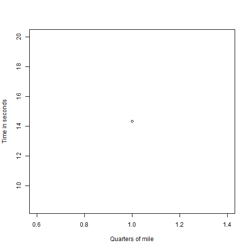

Quarter Mile Prediction Application
========================================================
author: Russ Thomas
date: 07/20/2017
autosize: true

MTCars
========================================================

Contained within the mtcars dataset is enough information to get a pretty good idea about how weight and displacement affect the potential quarter mile time of a given vehicle.  This application makes that prediction simple by allowing you to adust the inputs weight and displacement with calculations automatically generated.

https://sqljudo.shinyapps.io/quarter_mile/

Inputs include:

- Weight (in tons)
- Displacement (in cubic inches)


The model is based on this sample code
========================================================


```r
    input <- data.frame(weight=2, displacement=300)

    mod <- lm(qsec ~ wt + disp, mtcars)
    
    nd1 <- data.frame(wt=input$weight, disp=input$displacement)

    quarter_mile <- predict(mod, nd1)
```

Generating the following plot
========================================================



Enjoy!
========================================================

Thank you.  Please enjoy the application.
